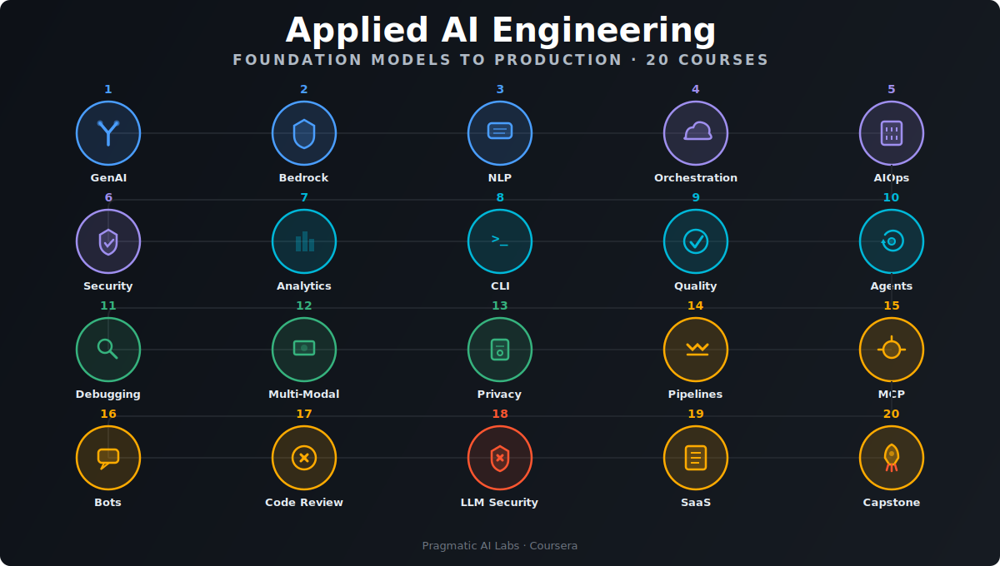

# AI Tooling

<p align="center">
  
</p>

**From Foundation Models to Production** — a 20-course Coursera specialization
that takes you from generative AI fundamentals on AWS through deterministic
agents and multi-modal programming to serverless multi-model architectures.

**Enroll on Coursera:** [AI Tooling Specialization](https://www.coursera.org/specializations/ai-tooling)

## Courses

| # | Course | Focus | Companion Repo | Capstone |
|---|--------|-------|---------------|----------|
| 1 | [**Generative AI and Foundation Models on AWS**](https://www.coursera.org/learn/aws-generative-ai-and-foundation-models) | Tokenization, RAG, Bedrock, llama.cpp, SageMaker Canvas | — | [Capstone](capstones/c01-capstone.md) |
| 2 | [**Intelligent Applications with Amazon Bedrock**](https://www.coursera.org/learn/aws-intelligent-applications-with-amazon-bedrock) | Bedrock console, Claude, Dracula pattern, knowledge bases, agents | — | [Capstone](capstones/c02-capstone.md) |
| 3 | [**Prompt Architecture and NLP on Amazon Bedrock**](https://www.coursera.org/learn/bedrock) | Token lifecycle, prompt-as-code, chain-of-thought, Ollama bridge | — | [Capstone](capstones/c03-capstone.md) |
| 4 | [**AI Orchestration: From Local Models to Cloud**](https://www.coursera.org/learn/ai-orchestration-from-local-models-to-cloud) | Prompt pyramid, caching, Ollama, llamafile, GPU computing, Spot | — | [Capstone](capstones/c04-capstone.md) |
| 5 | [**Enterprise AIOps and Amazon Q Business**](https://www.coursera.org/learn/enterprise-aiops-with-amazon-q-business) | Q Business, CloudShell, cost control, MLOps, RAG workflows | — | [Capstone](capstones/c05-capstone.md) |
| 6 | [**AI Security and Governance on AWS**](https://www.coursera.org/learn/ai-security-and-governance-on-aws) | Guardrails, CloudTrail, auth patterns, SageMaker Clarify, Rust | — | [Capstone](capstones/c06-capstone.md) |
| 7 | [**AI-Powered Analytics and Performance Engineering**](https://www.coursera.org/learn/ai-powered-analytics-and-performance-engineering) | Lambda, Rust, Amazon Q, CodeCatalyst, benchmarking | — | [Capstone](capstones/c07-capstone.md) |
| 8 | [**CLI Automation with Amazon Q and CloudShell**](https://www.coursera.org/learn/cli-automation-with-amazon-q-and-cloudshell) | Q CLI, Docker, CDK, Lambda, ECR, infrastructure as code | — | [Capstone](capstones/c08-capstone.md) |
| 9 | [**Deterministic LLM Programming and Quality Metrics**](https://www.coursera.org/learn/deterministic-llm-programming) | Code quality, AST analysis, technical debt, PMAT, Elo ratings | [deterministic-llm-coding](https://github.com/paiml/deterministic-llm-coding) | [Capstone](capstones/c09-capstone.md) |
| 10 | [**Agentic AI: Actor Models and Subagent Architecture**](https://www.coursera.org/learn/actor) | Actix, Rust, Go, Deno, supervision trees, subagents | [agentic-ai](https://github.com/paiml/agentic-ai) | [Capstone](capstones/c10-capstone.md) |
| 11 | [**AI-Assisted Debugging and Test-Driven Fixes**](https://www.coursera.org/learn/ai-debugging) | AI debugging, TDD, logging, context gathering, bug discovery | [ds500-debug-with-ai](https://github.com/paiml/ds500-debug-with-ai) | [Capstone](capstones/c11-capstone.md) |
| 12 | [**Multi-Modal AI: Screenshots to Production Code**](https://www.coursera.org/learn/multi-modal-ai) | Copilot, screenshot-to-code, Playwright, MCP, visual programming | [multi-modal-programming-course](https://github.com/paiml/multi-modal-programming-course) | [Capstone](capstones/c12-capstone.md) |
| 13 | [**Privacy-Conscious Development with AI Assistants**](https://www.coursera.org/learn/privacy-conscious-development-with-ai-assistants) | GitHub Advanced Security, Dependabot, Grype, secure prompting | [windsurf](https://github.com/paiml/windsurf) | [Capstone](capstones/c13-capstone.md) |
| 14 | [**AI-Powered Data Pipelines with Deno**](https://www.coursera.org/learn/ai-powered-data-pipelines-with-deno) | Deno tasks, pre-commit hooks, quality gates, pipeline automation | [data-pipelines-deno-typescript-course](https://github.com/paiml/data-pipelines-deno-typescript-course) | [Capstone](capstones/c14-capstone.md) |
| 15 | [**Building Deterministic MCP Agents**](https://www.coursera.org/learn/building-deterministic-mcp-agents) | MCP, provable contracts, property testing, fuzz testing, Kani BMC | [deterministic-mcp-agents](https://github.com/paiml/deterministic-mcp-agents) | [Capstone](capstones/c15-capstone.md) |
| 16 | [**Conversational Bot Architecture with Rust and Deno**](https://www.coursera.org/learn/conversational-bot-architecture-with-rust-and-deno) | Tokio, async runtime, memory safety, Discord, Bedrock | [universal-bot](https://github.com/paiml/universal-bot) | [Capstone](capstones/c16-capstone.md) |
| 17 | [**AI Code Review Automation with GitHub Actions**](https://www.coursera.org/learn/ai-code-review-automation-with-github-actions) | Actions, code review, LLM prompting, GitHub Marketplace | [pmat-action](https://github.com/paiml/pmat-action) | [Capstone](capstones/c17-capstone.md) |
| 18 | [**LLM Security: Vulnerabilities and Defense Patterns**](https://www.coursera.org/learn/llm-security-and-vulnerabilities) | Prompt injection, model theft, information disclosure, plugin security | — | [Capstone](capstones/c18-capstone.md) |
| 19 | [**Build a Production SaaS Application with AI**](https://www.coursera.org/learn/build-a-production-saas-application-with-ai) | API design, Docker, GitHub Pages, test harnesses, MVP | [wine-api-saas](https://github.com/paiml/wine-api-saas) | [Capstone](capstones/c19-capstone.md) |
| 20 | [**AI Engineering Capstone: Serverless Multi-Model Systems**](https://www.coursera.org/learn/ai-tooling-capstone-serverless-multi-model-systems) | Cargo Lambda, Bedrock routing, YAML prompts, production deployment | — | [Capstone](capstones/c20-capstone.md) |

## Installation

```bash
git clone https://github.com/paiml/ai-tooling.git
cd ai-tooling
make check
```

## Usage

```bash
make help          # Show available commands
make lint          # Lint markdown files
make test          # Validate course structure (20 courses, capstone sections)
make check         # Run lint + test
```

## Capstone Projects

<p align="center">
  
</p>

Each course includes a hands-on capstone project that integrates all modules into a realistic scenario. Completed capstones can be shared on LinkedIn as portfolio projects. See the [capstones/](capstones/) directory.

## Structure

Each course is ~60 minutes of 3–5 minute videos organized as:

**Course → Module → Lesson (3–5 videos) → Key Terms + Reflection**

Every module ends with a **Critical Thinking Assessment** (quiz + role-play practice assignment).

## Instructors

- **Noah Gift** — Founder, Pragmatic AI Labs · Duke University (Courses 1–10, 13, 15, 20)
- **Alfredo Deza** — Author and content creator · Python, Rust, DevOps, ML (Courses 11, 12, 14, 16–19)

## License

Course content copyright Pragmatic AI Labs. Code examples are MIT licensed.
